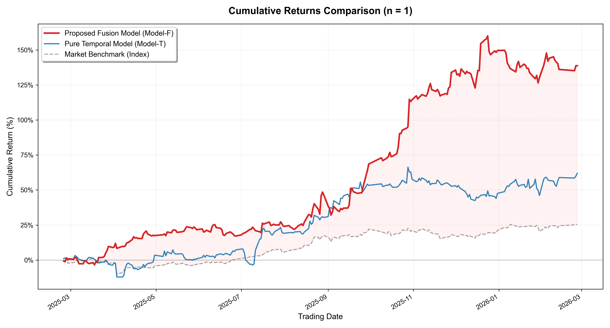
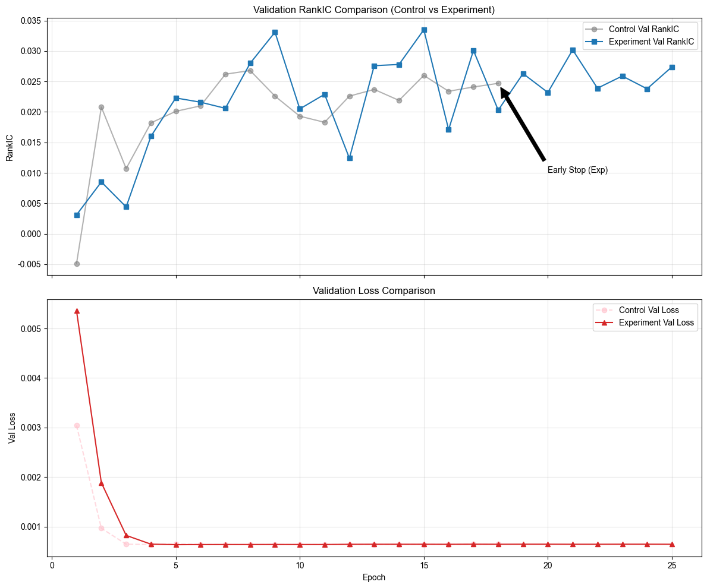
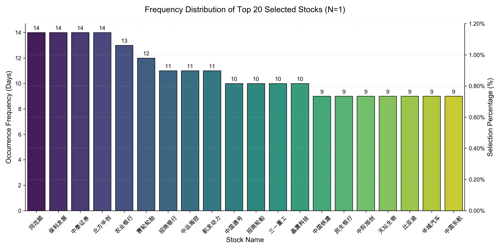
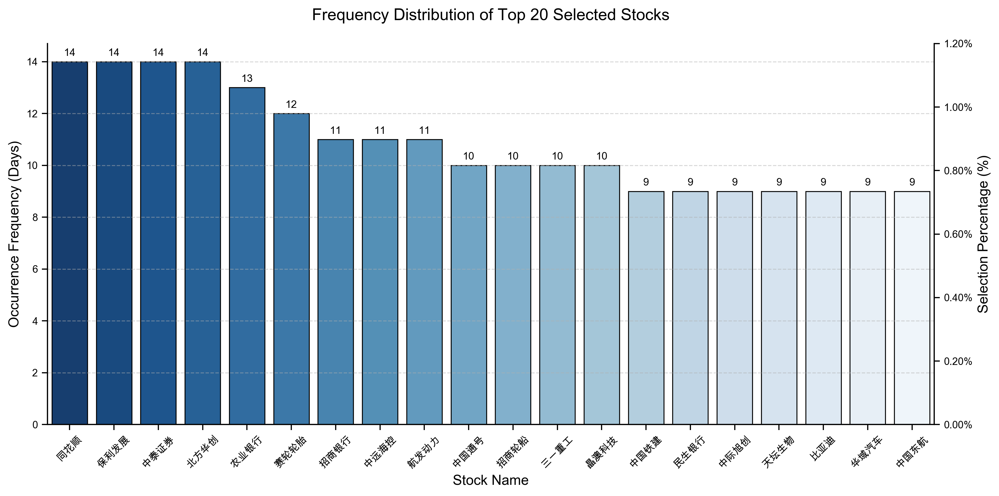
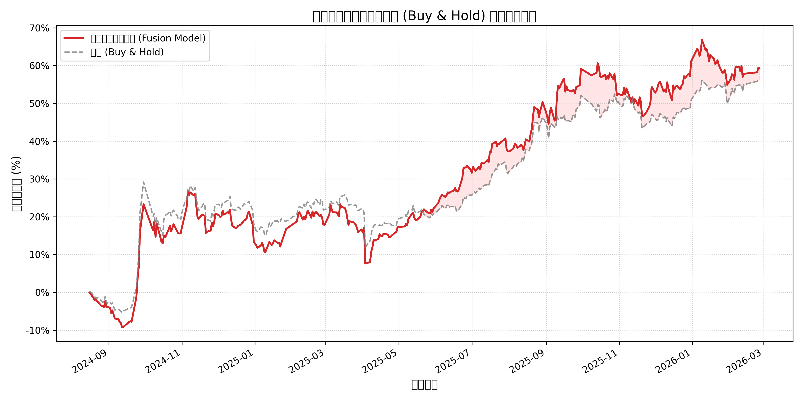
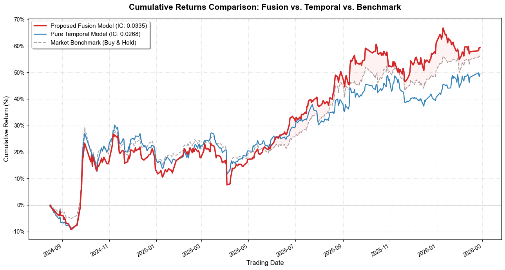

# Mixed-Frequency Deep Learning for Cross-Sectional Stock Prediction

**Do financial statements still add alpha beyond price and volume? An empirical study on CSI 300 constituents.**

`Python` · `PyTorch` · `pandas` · `627,075 stock-day observations` · `1,225-day backtest`

---

## TL;DR

- Built a **mixed-frequency deep learning** pipeline that combines **quarterly financial statement data** (MLP branch) with **daily price/volume data** (CNN-LSTM branch), fused by a **self-attention** layer.
- Trained with a **pairwise ranking loss** so the model directly optimizes the cross-sectional ranking of stocks instead of pointwise return regression — the objective that actually matters for stock selection.
- Adding financial features improved cross-sectional **Mean IC by ~26%** (0.0073 → 0.0092) and **RankIC by ~33%** (0.0050 → 0.0067) versus a price-only baseline, with ICIR improving from 0.11 to 0.16.
- A daily top-1 selection backtest over 1,225 trading days reached **+144.7% annualized (Sharpe 2.98, max drawdown −12.9%)** under the study's assumptions, versus **+26.2% (Sharpe 1.62)** for the equal-weighted CSI 300 benchmark. See [Backtest caveats](#6-backtest-caveats) before reading anything into these numbers.

---

## 1. Motivation

Most daily-frequency stock-selection models are trained and evaluated only on price/volume data. Accounting fundamentals are updated quarterly and move slowly — yet they are the primary channel through which firm value is communicated to the market.

This project asks a narrow, practical question:

> **When market and fundamental data have different sampling frequencies, does a deep model with an explicit fusion mechanism extract incremental predictive power from financial statements?**

The design choices follow directly from that question:

| Design choice | Why |
|---|---|
| Separate MLP branch for quarterly financials | Fundamentals are tabular, low-frequency and smooth — a different inductive bias from price series |
| CNN-LSTM branch for daily OHLCV | CNN captures local price-volume structure; LSTM captures longer temporal dependence |
| Self-attention at the fusion layer | Lets the model dynamically re-weight fundamental vs. technical signals as the regime changes |
| Pairwise ranking loss | Portfolio construction only needs the *order* of predicted returns, not their level |

---

## 2. Data

| Block | Frequency | Content | Source |
|---|---|---|---|
| Price / volume | Daily | OHLCV and derived technical inputs for CSI 300 constituents | Wind terminal (`WindPy`) |
| Financial statements | Quarterly (forward-filled to daily) | Balance-sheet, income-statement and cash-flow items, standardized | Wind terminal (`WindPy`) |

- Sample: CSI 300 constituents, **2016 – 2026**, 627,075 stock-day rows.
- Raw data is **not redistributed** in this repository (Wind license). `notebooks/01_data_fetch.ipynb` contains the full extraction logic and requires a licensed Wind terminal.

Descriptive statistics of the raw features are in [`results/descriptive_stats.xlsx`](results/descriptive_stats.xlsx) and [`results/feature_statistics.csv`](results/feature_statistics.csv).

---

## 3. Methodology

```
quarterly financials ──► MLP encoder ──────────┐
                                               ├─► Self-Attention fusion ─► ranking head
daily OHLCV ──► CNN (local) ──► LSTM (temporal)┘        (Pairwise ranking loss)
```

**Mixed-frequency handling.** Financial features are aligned to the trading calendar by forward-filling each statement item from its disclosure date, so the model can only use information available at prediction time.

**Model.** Two asymmetric encoders (MLP for fundamentals, CNN-LSTM for price-volume), a single-head self-attention block that learns per-sample fusion weights, and a linear ranking head.

**Objective.** Pairwise ranking loss over stocks within each cross-section — the model is penalized when a lower-ranked stock is predicted above a higher-ranked one. This reduced the tendency of plain regression to chase the magnitude of noisy daily returns.

**Ablation.** Two runs are trained with identical pipelines:

- **Model-T** — price/volume branch only (technical baseline)
- **Model-F** — full fused model

The fusion-layer attention weights are inspected per period to check whether the model shifts between fundamental and technical logic over time.

---

## 4. Results

### Predictive metrics (validation, cross-sectional)

| Model | MSE | Mean IC ↑ | Mean RankIC ↑ | ICIR ↑ | RankICIR ↑ |
|---|---|---|---|---|---|
| Model-T (price only) | 0.000525 | 0.0073 | 0.0050 | 0.110 | 0.075 |
| **Model-F (fused)** | 0.000530 | **0.0092** | **0.0067** | **0.164** | **0.114** |

Financial information buys a clear improvement in *rank* quality (+26% IC, +33% RankIC, +49% ICIR) while leaving point-error metrics essentially unchanged. For a stock-selection use case, that is the trade-off that matters.





### Stock selection behaviour





---

## 5. Backtest

Daily selection of the top-ranked stock, 1,225 trading days:

| Strategy | Annualized return | Sharpe | Max drawdown | Alpha |
|---|---|---|---|---|
| Model-F (fused) | 144.7% | 2.98 | −12.9% | 118.5% |
| Model-T (price only) | 64.2% | 1.72 | −14.9% | 37.9% |
| CSI 300 (equal-weight benchmark) | 26.2% | 1.62 | −11.1% | — |

Top-1 selection diagnostics: win rate **49.3%**, average daily return **0.30%**.





### 6. Backtest caveats

These are simulation results, not live performance. Known limitations:

- No full market-impact or capacity modelling; a top-1 strategy is not deployable at scale without significant slippage.
- Single market (CSI 300), single historical window; the prediction window overlaps a specific macro regime.
- Transaction costs, borrow constraints and limit-up/limit-down frictions are simplified.
- Standard overfitting risk for any pipeline selected partly on validation metrics.

The honest reading of the backtest is directional evidence — *financial features improve the ranking signal* — not a claim of 145% annual returns.

---

## 7. Repository layout

```
mixed-frequency-stock-prediction/
├── notebooks/
│   ├── 01_data_fetch.ipynb                # Wind extraction → raw parquet
│   ├── 02_data_clean.ipynb                # Cleaning, alignment, normalization
│   ├── 03_mixed_frequency_training.ipynb  # Main fusion model (MLP + CNN-LSTM + attention)
│   ├── 04_temporal_training.ipynb         # Temporal-only variant
│   └── 05_backtest.ipynb                  # Portfolio construction & evaluation
├── figures/                               # Result charts (used in this README)
├── results/
│   ├── strategy_performance.csv / .xlsx   # Backtest metrics
│   ├── model_performance_comparison.xlsx  # IC / RankIC / ICIR comparison
│   ├── descriptive_stats.xlsx             # Feature distribution stats
│   └── top_*_stock_list_with_names.csv    # Daily selections
├── requirements.txt
└── LICENSE
```

---

## 8. Reproducing

```bash
python -m venv .venv && source .venv/bin/activate
pip install -r requirements.txt
jupyter lab
```

- `01_data_fetch.ipynb` requires a licensed **Wind terminal** (Python API `WindPy`). Without it, start from your own price/statement parquet files placed under `data/` with the same schema, then run notebooks `02 → 05` in order.
- Training uses PyTorch (CPU is enough for this model size; ~minutes per epoch). Model weights (`*.pth`) are intentionally not committed.

---

## 9. Limitations & next steps

- Add neutralization (industry / size) and check incremental IC after neutralization.
- Walk-forward retraining instead of a single split.
- Model realistic costs and capacity; evaluate a top-N portfolio rather than top-1.
- Extend the fusion layer to more frequency bands (weekly analyst data, monthly macro).

---

## License

MIT © 2026 Venti. See [LICENSE](LICENSE).
